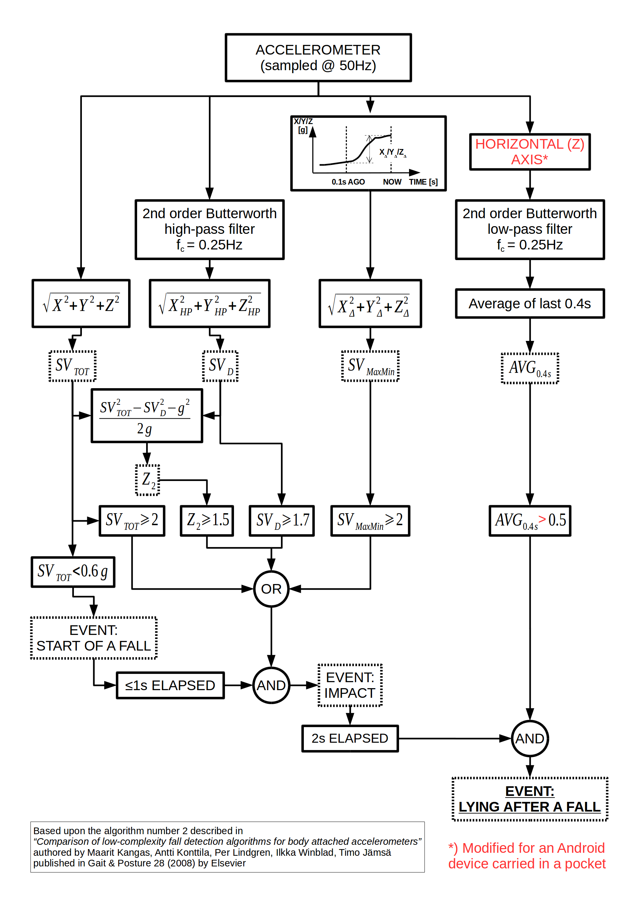

# Ứng dụng hỗ trợ phát hiện ngã và cảnh báo cho người khuyết tật vận động

## Giới thiệu

Khi người mang điện thoại bị ngã, ứng dụng sẽ gửi tin nhắn SMS đến số khẩn cấp.

## Hướng dẫn sử dụng
* Đảm bảo thêm số điện thoại khẩn cấp để ứng dụng tự động gọi khi phát hiện có sự cố ngã.
* Nếu người sở hữu số khẩn cấp gửi tin nhắn SMS có chứa từ "position" thì ứng dụng sẽ tự động phản hồi lại bằng tin nhắn SMS kèm theo vị trí địa lý.
* Nếu tin nhắn SMS chứa từ "alarm", ứng dụng sẽ phát âm thanh cảnh báo.
* Ứng dụng sẽ tự động khởi động khi điện thoại được bật.
* Để đạt hiệu suất tối ưu, hãy mang thiết bị gần vị trí thắt lưng.

## CREDITS

Thuật toán phát hiện ngã dựa trên thuật toán thứ hai được mô tả trong bài báo
*"Comparison of low-complexity fall detection algorithms for body attached accelerometers"*
của Maarit Kangas, Antti Konttila, Per Lindgren, Ilkka Winblad, Timo Jamsa
và được đăng ở Gait & Posture 28 (2008) bởi Elsevier (Link dẫn bài báo [link](https://scholar.google.nl/scholar?hl=en&q=Comparison+of+low-complexity+fall+detection+algorithms+for+body+attached+accelerometers+Kangas+Konttila+Lindgren+Winblad+Jamsa))

